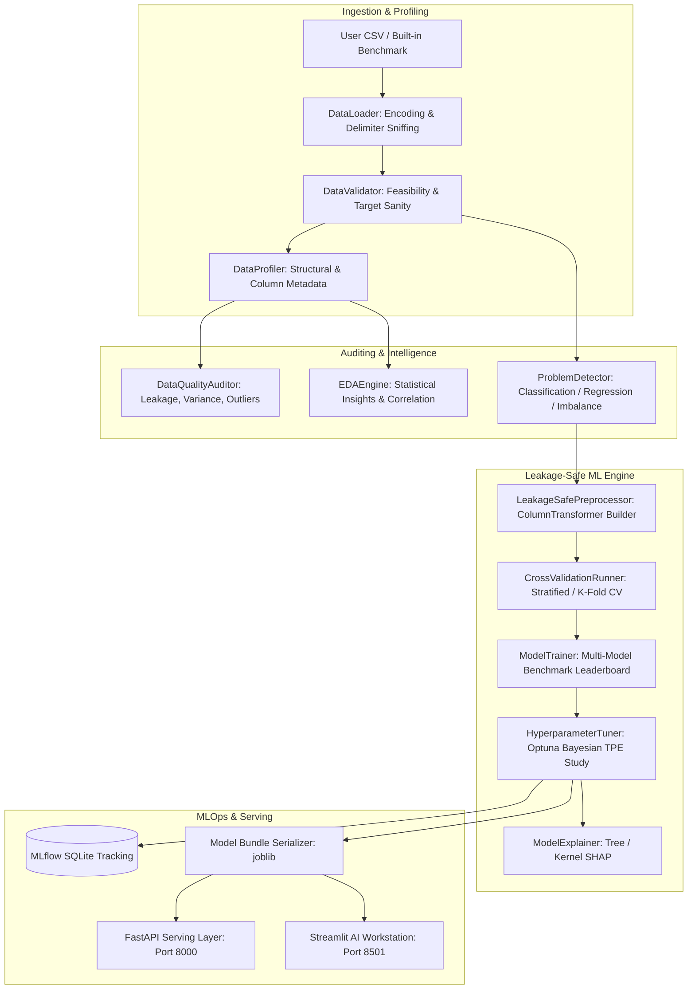

# Autonomous Data Scientist 🧠⚡

> **From raw data to an explainable, production-ready ML model.**
> An autonomous, local-first AI/ML workstation and serving platform engineered for tabular datasets.

[](https://python.org)
[](https://fastapi.tiangolo.com)
[](https://streamlit.io)
[](https://scikit-learn.org)
[](https://xgboost.readthedocs.io)
[](https://optuna.org)
[](https://mlflow.org)
[](https://docker.com)
[](https://opensource.org/licenses/MIT)

---

## 1. Project Overview

**Autonomous Data Scientist** is a production-quality, local-first machine learning engineering platform that automates the end-to-end data science lifecycle for arbitrary tabular CSV datasets. Rather than functioning as a black-box AutoML wrapper or simple mock dashboard, the platform implements genuine statistical profiling, anomaly detection, leakage-safe pipeline construction, cross-validated model benchmarking, Optuna Bayesian hyperparameter optimization, game-theoretic SHAP explainability, local MLflow tracking, and high-performance FastAPI model serving.

The system is designed with a **Linear/Raycast-inspired dark workstation aesthetic**, prioritizing observable decision-making over fabricated artificial intelligence claims.

---

## 2. Why This Project Exists

Traditional AutoML tools often suffer from one of two extremes:
1. **Black-box libraries** (e.g. AutoGluon, TPOT) that execute complex ensemble tricks while obscuring data leakage, intermediate decisions, and serving-friendly pipelines.
2. **Generic toy dashboards** that display pre-baked charts, hardcoded metrics, or simulated progress bars without real underlying model training.

**Autonomous Data Scientist bridges this gap** by combining:
- **Architectural Rigor**: Clean, decoupled separation of data validation, feature engineering, model training, and API serving.
- **Zero-Leakage Guarantees**: Strict encapsulation inside `sklearn.compose.ColumnTransformer` and `sklearn.pipeline.Pipeline`, fitting transformers exclusively on training splits/folds.
- **Technical Honesty**: Every displayed metric, ROC-AUC score, hyperparameter tuning step, and SHAP attribution stems directly from active computational experiments.
- **Production-Ready Artifacts**: Persisting self-contained model bundles capable of immediate batch or real-time inference via REST API.

---

## 3. Architecture Overview



---

## 4. Key Features

- **Automated Dialect & Encoding Detection**: Parses UTF-8, Latin-1, CP1252, tab-delimited, semicolon-delimited, and standard comma-separated tabular files.
- **Data Quality & Leakage Auditor**: Identifies high missingness, duplicate rows, zero-variance dead features, high-cardinality IDs, extreme outliers, and potential target leakage (>0.98 correlation).
- **Observable Problem Taxonomy**: Infers binary classification, multiclass classification, or continuous regression, identifies class imbalance ratios, and selects optimal validation strategies.
- **Zero-Leakage Preprocessing**: Builds dynamic pipelines with median/mode imputation, robust/standard scaling, and one-hot/ordinal encoding fit strictly within CV folds.
- **Candidate Benchmarking**:
  - *Classification*: Logistic Regression, Random Forest, HistGradientBoosting, XGBoost.
  - *Regression*: Ridge Regression, Random Forest Regressor, HistGradientBoosting Regressor, XGBoost Regressor.
- **Optuna Bayesian Optimization**: Tree-structured Parzen Estimator (TPE) algorithm exploring hyperparameter search spaces with live trial score tracking.
- **SHAP Game-Theoretic Explainability**: Global feature importance and individual sample waterfall/force attributions with plain-English interpretations.
- **Local MLOps Tracking**: Embedded SQLite backend (`sqlite:///mlflow.db`) logging parameters, metrics, artifacts, and model tags.
- **FastAPI Model Serving**: RESTful endpoints (`/health`, `/model`, `/metrics`, `/predict`, `/predict/batch`) validated via Pydantic schemas.

---

## 5. Technology Stack

| Domain | Technologies |
|---|---|
| **Core & ML** | Python 3.12, Pandas, NumPy, Scikit-learn, XGBoost, Optuna, SHAP, Joblib |
| **Experiment Tracking** | MLflow (Local SQLite Store) |
| **API & Serving** | FastAPI, Uvicorn, Pydantic v2 |
| **UI & Visualization** | Streamlit, Plotly Express, Plotly Graph Objects |
| **Quality & Testing** | Pytest, HTTPX TestClient |
| **Containerization** | Docker, Docker Compose |

---

## 6. Installation & Quickstart

### Prerequisites
- Python 3.12+
- Git

### Local Setup (Virtual Environment)
```bash
# 1. Clone repository
git clone https://github.com/adityarana/DataPilot.git
cd DataPilot

# 2. Create and activate virtual environment
python3 -m venv .venv
source .venv/bin/activate  # On Windows: .venv\Scripts\activate

# 3. Install dependencies
pip install -r requirements.txt

# 4. Generate built-in benchmark datasets
python3 data/generate_datasets.py
```

### Running the Services Locally

#### Launch Streamlit AI Workstation:
```bash
streamlit run dashboard/app.py --server.port 8501
```
Visit: `http://localhost:8501`

#### Launch FastAPI Model Serving:
```bash
uvicorn app.api.main:app --host 0.0.0.0 --port 8000 --reload
```
API Documentation (Swagger UI): `http://localhost:8000/docs`

#### Launch MLflow Tracking UI:
```bash
mlflow ui --backend-store-uri sqlite:///mlflow.db --port 5000
```
MLflow Dashboard: `http://localhost:5000`

---

## 7. Docker Deployment

Launch all 3 services (`FastAPI`, `Streamlit`, `MLflow`) with a single command:

```bash
docker compose up --build
```

- **Streamlit Workstation**: `http://localhost:8501`
- **FastAPI Serving API**: `http://localhost:8000`
- **MLflow Tracking UI**: `http://localhost:5000`

To stop:
```bash
docker compose down
```

---

## 8. Data Leakage Prevention Guarantee

Data leakage occurs when information from outside the training dataset is inadvertently used to train or preprocess a model. **Autonomous Data Scientist enforces zero leakage through structural guarantees**:

1. **Pipeline Encapsulation**: All scaling (`StandardScaler`), imputation (`SimpleImputer`), and categorical encoding (`OneHotEncoder`) are wrapped inside an `sklearn.compose.ColumnTransformer` embedded in an `sklearn.pipeline.Pipeline`.
2. **Cross-Validation Folding**: In each CV fold, the entire pipeline is re-instantiated and fitted *strictly* on that fold's training indices. The validation fold is strictly transformed using the frozen training parameters.
3. **Hyperparameter Tuning Isolation**: Optuna trials evaluate candidate parameters using inner cross-validation folds, never touching a holdout test split.
4. **Target Segregation**: Target variables are never exposed to feature preprocessors.

---

## 9. API Documentation

### Available Endpoints

#### 1. `GET /health`
Verifies API status and indicates if a trained model is loaded.
```json
{
  "status": "healthy",
  "model_loaded": true,
  "model_name": "XGBoost Classifier",
  "timestamp": "2026-09-08T00:15:00.123456"
}
```

#### 2. `GET /model`
Returns the metadata, feature schema, and target definition of the registered model.

#### 3. `GET /metrics`
Returns optimization scores, baseline scores, and optimal hyperparameter values.

#### 4. `POST /predict`
Executes single-record inference.
```bash
curl -X POST "http://localhost:8000/predict" \
     -H "Content-Type: application/json" \
     -d '{
       "features": {
         "age": 42,
         "tenure_months": 18,
         "monthly_charges": 84.50,
         "contract_type": "Month-to-month",
         "internet_service": "Fiber optic",
         "tech_support": "No",
         "payment_method": "Electronic check"
       }
     }'
```
Response:
```json
{
  "status": "success",
  "prediction": "1",
  "probability": 0.824,
  "probabilities": {
    "0": 0.176,
    "1": 0.824
  },
  "problem_type": "binary_classification"
}
```

#### 5. `POST /predict/batch`
Accepts a list of feature dictionaries and returns batch predictions and confidence arrays.

---

## 10. Automated Testing Suite

The repository includes comprehensive unit and integration tests covering data loading, validation, problem detection, leakage safety, cross-validation, Optuna tuning, SHAP explainability, and FastAPI endpoints.

Run the test suite:
```bash
pytest -v tests/
```

Expected output:
```text
tests/test_api.py::test_api_health PASSED
tests/test_api.py::test_api_predict_flow PASSED
tests/test_data_loader_validator.py::test_loader_from_string PASSED
tests/test_data_loader_validator.py::test_loader_empty_raises PASSED
tests/test_data_loader_validator.py::test_loader_delimiter_sniffing PASSED
tests/test_data_loader_validator.py::test_validator_min_rows PASSED
tests/test_data_loader_validator.py::test_validator_missing_target PASSED
tests/test_data_loader_validator.py::test_validator_single_value_target PASSED
tests/test_data_loader_validator.py::test_validator_valid_dataset PASSED
tests/test_data_loader_validator.py::test_profiler_and_quality_audit PASSED
tests/test_explainability.py::test_shap_explainability_generation PASSED
tests/test_modeling_and_cv.py::test_cross_validation_and_benchmarking_classification PASSED
tests/test_modeling_and_cv.py::test_regression_cross_validation PASSED
tests/test_problem_detector.py::test_detect_binary_classification PASSED
tests/test_problem_detector.py::test_detect_imbalanced_classification PASSED
tests/test_problem_detector.py::test_detect_regression PASSED
tests/test_preprocessing.py::test_leakage_safe_preprocessor_fitting PASSED
tests/test_tuner_optuna.py::test_optuna_tuning_loop PASSED
```

---

## 11. Project Directory Structure

```text
DataPilot/
├── app/
│   ├── api/
│   │   ├── __init__.py
│   │   ├── main.py
│   │   └── schemas.py
│   ├── data/
│   │   ├── __init__.py
│   │   ├── loader.py
│   │   ├── validator.py
│   │   ├── profiler.py
│   │   ├── quality.py
│   │   ├── preprocessing.py
│   │   └── eda.py
│   ├── ml/
│   │   ├── __init__.py
│   │   ├── problem_detector.py
│   │   ├── models.py
│   │   ├── evaluator.py
│   │   ├── cross_validation.py
│   │   ├── trainer.py
│   │   ├── tuner.py
│   │   └── explainability.py
│   ├── tracking/
│   │   ├── __init__.py
│   │   └── mlflow_tracker.py
│   └── services/
│       ├── __init__.py
│       └── pipeline.py
├── dashboard/
│   ├── app.py
│   └── components/
│       ├── __init__.py
│       └── styles.py
├── data/
│   ├── generate_datasets.py
│   ├── churn.csv
│   └── housing.csv
├── tests/
├── artifacts/
├── Dockerfile
├── docker-compose.yml
├── requirements.txt
├── README.md
└── .gitignore
```

---

## 12. License & Author

Developed by **Aditya Rana**. Released under the MIT License.
